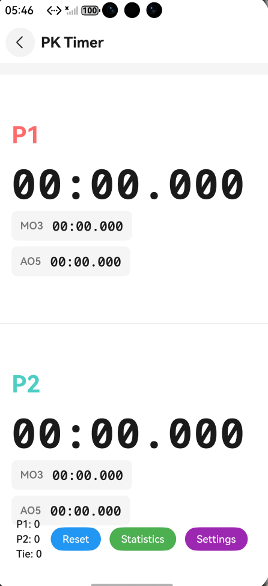
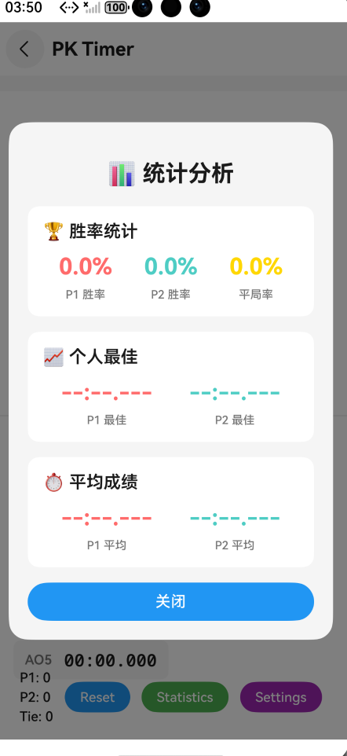
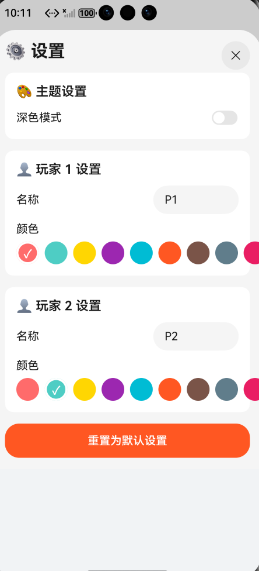

# PK Timer

一个基于HarmonyOS开发的PK计时器应用，支持双人竞技计时功能。

## 项目简介

PK Timer是一个专为竞技场景设计的计时器应用，将屏幕分为上下两个区域，分别用于两位选手（P1和P2）的计时。应用会自动比较两位选手的用时，用时较少者将被标记为胜者，并实时显示比赛统计数据。

## 界面展示

### 主页面


主页面展示了双人竞技计时器的核心界面，屏幕分为上下两个区域，分别显示P1和P2的计时器、统计数据和比分信息。

### 统计分析页面


统计分析页面提供了详细的数据分析功能，包括胜率统计、个人最佳成绩和平均成绩等关键指标。

### 设置页面


设置页面支持个性化配置，包括选手名称自定义、颜色主题选择和深色/浅色模式切换。

## 功能特性

### 核心功能
- **双人竞技计时**：屏幕上下分区，分别控制P1和P2的计时器
- **实时统计**：
  - MO3（Mean of 3）：最近3次成绩的平均值（去掉最好和最差成绩）
  - AO5（Average of 5）：最近5次成绩的平均值（去掉最好和最差成绩）
  - 个人最佳：记录每位选手的最佳成绩
  - 平均成绩：所有成绩的平均值
  - 最差成绩：记录每位选手的最差成绩
  - 标准差：成绩的稳定性指标
- **胜负判定**：自动比较两位选手的用时，判定胜者
- **比分统计**：实时记录P1胜场、P2胜场和平局次数
- **胜利展示**：获胜者区域会显示庆祝动画（🎉 WINNER!）
- **一键重置**：支持重置所有计时器和比分数据

### 统计分析
- **胜率统计**：显示P1胜率、P2胜率、平局率
- **个人最佳**：显示两位选手的最佳成绩
- **成绩趋势图表**：使用Canvas绘制折线图，可视化展示两位选手的成绩变化趋势

### 个性化设置
- **选手名称自定义**：
  - 支持修改P1和P2的显示名称
  - 实时更新所有界面的选手名称
- **颜色主题自定义**：
  - 为每位选手选择专属颜色（10种预设颜色）
  - 颜色应用于计时器、统计图表等所有相关界面
- **深色/浅色模式**：
  - 支持深色模式和浅色模式切换
  - 自动适配所有界面元素的颜色
  - 提供舒适的视觉体验

## 技术栈

- **开发语言**：ArkTS
- **开发框架**：ArkUI
- **运行平台**：HarmonyOS
- **最小SDK版本**：6.0.2(22)
- **目标SDK版本**：6.0.2(22)

## 项目结构

```
PKTimer/
├── AppScope/                    # 应用全局配置
│   ├── app.json5               # 应用配置文件
│   └── resources/              # 应用全局资源文件
├── entry/                      # 主模块
│   ├── src/
│   │   └── main/
│   │       ├── ets/
│   │       │   ├── common/
│   │       │   │   └── AppConfig.ets           # 全局配置管理
│   │       │   ├── entryability/
│   │       │   │   └── EntryAbility.ets        # 应用入口
│   │       │   ├── entrybackupability/
│   │       │   │   └── EntryBackupAbility.ets  # 应用备份扩展能力
│   │       │   └── pages/
│   │       │       ├── Index.ets               # 主页面
│   │       │       ├── Home.ets                # 计时器组件和逻辑
│   │       │       ├── Statistics.ets          # 统计分析页面
│   │       │       └── Settings.ets            # 设置页面
│   │       ├── resources/                       # 模块资源文件
│   │       │   └── base/
│   │       │       ├── element/                # 字符串、颜色等资源
│   │       │       ├── media/                  # 媒体资源
│   │       │       └── profile/                # 配置文件
│   │       └── module.json5                     # 模块配置文件
│   ├── build-profile.json5    # 模块构建配置
│   ├── hvigorfile.ts          # 模块编译配置
│   └── oh-package.json5       # 模块依赖配置
├── build-profile.json5         # 应用构建配置
├── hvigorfile.ts              # 应用编译配置
├── hvigor/                    # 编译配置文件
├── code-linter.json5          # 代码规范配置
└── oh-package.json5           # 依赖配置
```

## 核心文件说明

### 1. AppConfig.ets
全局配置管理类，提供：
- 选手名称和颜色的配置管理
- 深色/浅色主题切换
- 主题颜色配置（背景、文字、按钮等）
- 配置的持久化和更新

### 2. EntryAbility.ets
应用的入口文件，负责加载主页面 `pages/Index`。

### 3. Index.ets
主页面组件，包含：
- 两个计时器实例（P1和P2）
- 分数统计实例
- UI布局：上下分区的计时器显示和底部的比分统计与控制按钮
- 统计分析面板的绑定
- 设置面板的绑定

### 4. Home.ets
核心业务逻辑文件，包含：

#### Timer 类
计时器核心类，提供以下功能：
- `start()`: 开始计时
- `stop()`: 停止计时并记录成绩
- `reset()`: 重置计时器
- `updateStatistics()`: 更新MO3、AO5和高级统计数据
- `calculateAverage()`: 计算平均值（去掉最大值和最小值）
- `updateAdvancedStatistics()`: 更新个人最佳、平均成绩、最差成绩和标准差

#### Score 类
比分统计类，记录：
- P1胜场数
- P2胜场数
- 平局次数
- 最后获胜者
- 比赛历史记录
- 胜率计算方法

#### TopTimer 和 BottomTimer 组件
- P1和P2的计时器UI组件
- 点击交互：点击区域开始/停止计时
- 显示当前时间、MO3、AO5
- 获胜时显示庆祝动画
- 支持自定义名称和颜色
- 支持主题切换

### 5. Statistics.ets
统计分析页面组件，包含：
- 胜率统计卡片：显示P1胜率、P2胜率、平局率
- 个人最佳卡片：显示两位选手的最佳成绩
- 成绩趋势图表：使用Canvas绘制的折线图
  - 支持多条数据线（P1和P2）
  - 自动缩放和归一化数据
  - 绘制坐标轴、网格线、数据线和数据点
  - 响应式布局

### 6. Settings.ets
设置页面组件，包含：
- 主题设置：深色模式开关
- 玩家1设置：名称输入、颜色选择
- 玩家2设置：名称输入、颜色选择
- 重置为默认设置按钮

## 使用说明

### 计时操作
1. **开始计时**：点击P1或P2区域开始该选手的计时
2. **停止计时**：再次点击正在计时的区域停止计时
3. **胜负判定**：当两位选手都完成计时时，系统自动比较用时并判定胜者

### 比分统计
- 底部显示当前比分：P1胜场、P2胜场、平局次数
- 获胜者区域会显示 🎉 WINNER! 动画

### 统计分析
- 点击"Statistics"按钮打开统计分析面板
- 查看详细的胜率统计和个人最佳成绩
- 查看成绩趋势图表，直观了解成绩变化

### 个性化设置
- 点击"Settings"按钮打开设置面板
- **修改选手名称**：在输入框中输入新的名称
- **选择选手颜色**：点击颜色圆点选择喜欢的颜色
- **切换主题模式**：打开/关闭深色模式开关
- **重置设置**：点击"重置为默认设置"恢复默认配置

### 重置功能
- 点击底部的"Reset"按钮可重置所有计时器、统计数据和比分

## 构建与运行

### 环境要求
- DevEco Studio 5.0.0 Release
- HarmonyOS SDK API 12及以上

### 构建步骤
1. 使用DevEco Studio打开项目
2. 等待依赖自动下载完成
3. 连接HarmonyOS设备或启动模拟器
4. 点击Run按钮运行应用

## 依赖项

```json5
{
  "devDependencies": {
    "@ohos/hypium": "1.0.25",
    "@ohos/hamock": "1.0.0"
  }
}
```

## 测试

项目包含以下测试文件：
- `entry/src/test/LocalUnit.test.ets` - 本地单元测试
- `entry/src/ohosTest/ets/test/Ability.test.ets` - UI测试
